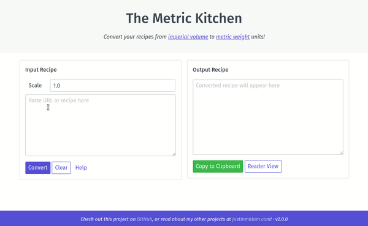

# Metric Recipe Converter
# Badges
[](https://github.com/namtonthat/recipe-converter/actions/workflows/build-and-deploy.yml)
[](https://coveralls.io/github/namtonthat/recipe-converter?branch=master)
[](https://recipe-converter.readthedocs.io/en/latest/?badge=latest)
[](https://opensource.org/licenses/MIT)

Web app to convert recipes from imperial volume to metric weight units.

**Live Project:** [recipe-converter.fly.dev](https://recipe-converter.fly.dev)

<p align="center">

</p>

## Features

+ Convert cups, tablespoons, and teaspoons of common ingredients to grams
+ Scale the recipe to any value
+ Option to load recipe from URL (if website is supported)
+ Reader view for distraction-free viewing (no ads or other fluff!)

Documentation is available on [recipe-converter.readthedocs.io](https://recipe-converter.readthedocs.io/en/latest/recipeconverter.html)

## Built With
+ [Recipe Scrapers](https://github.com/hhursev/recipe-scrapers) library (thanks [hhursev](https://github.com/hhursev))
+ [Flask](http://flask.pocoo.org/) backend
+ [Spectre](https://picturepan2.github.io/spectre/) frontend
+ [fly.io](https://www.fly.io/) hosting

## Getting Started

### General
Setup python environment (requires `poetry` and `pyenv` to manage python versions):

```bash
brew install poetry pyenv
pyenv install 3.8.15
pyenv local 3.8.15
poetry env use $(pyenv which python)
poetry shell
```

To install the package:
```bash
poetry build
poetry install --no-dev
```

To run the web app:

```bash
cd app/
flask run
```

### For Developers
#### Github Actions
```mermaid
graph TD
    A(New PR) --> B(merge into master branch)
    B --> C(build-and-deploy.yml triggered)
    C --> D(changes reflected <br><a href="https://recipe-converter.fly.dev/")>https://recipe-converter.fly.dev/</a>)
```

#### Local Development
To install dependencies:

```bash
poetry install
pip install -r docs/requirements.txt
```

To run development tasks:

```bash
# Run the tests
pytest tests/

# Build the docs
cd docs
make html
```

## Usage

Example usage of the module is shown below.

```python
import recipeconverter
rc = recipeconverter.RecipeConverter()

rc.convert_volume_to_mass("1 cup flour")
# 142 g flour

rc.convert_volume_to_mass("1 tsp sugar")
# 4.2 g sugar

recipe = """2/3 cup butter
1 cup sugar
3 bananas
1/2 teaspoon salt"""

rc.convert_recipe(recipe, multiplier=2.0)
# 302.7 g butter
# 396 g sugar
# 6 bananas
# 5 g salt

rc.convert_recipe_from_url("https://www.allrecipes.com/recipe/20144/banana-banana-bread/")
# 284 g all-purpose flour
# 6 g baking soda
# 1.2 g salt
# 113.5 g butter
# 148.5 g brown sugar
# 2 eggs, beaten
# 2.3 cup mashed overripe banana
```
